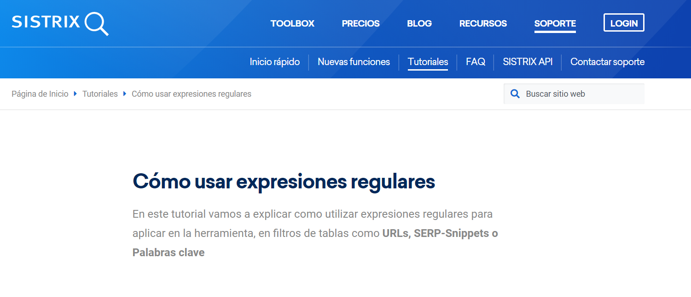
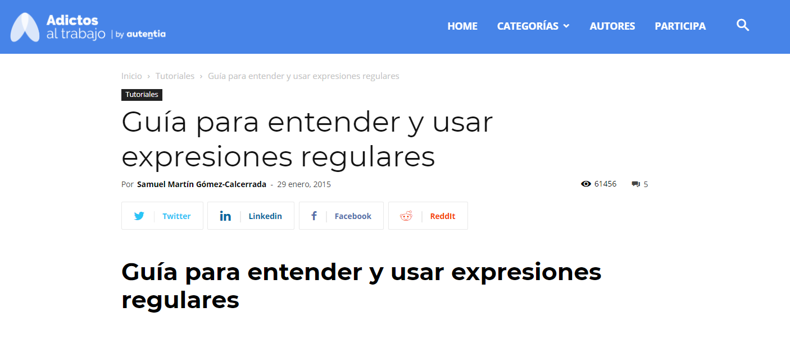
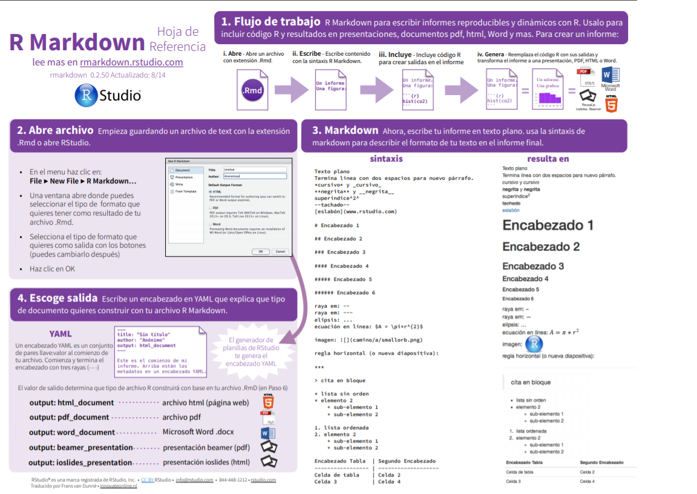
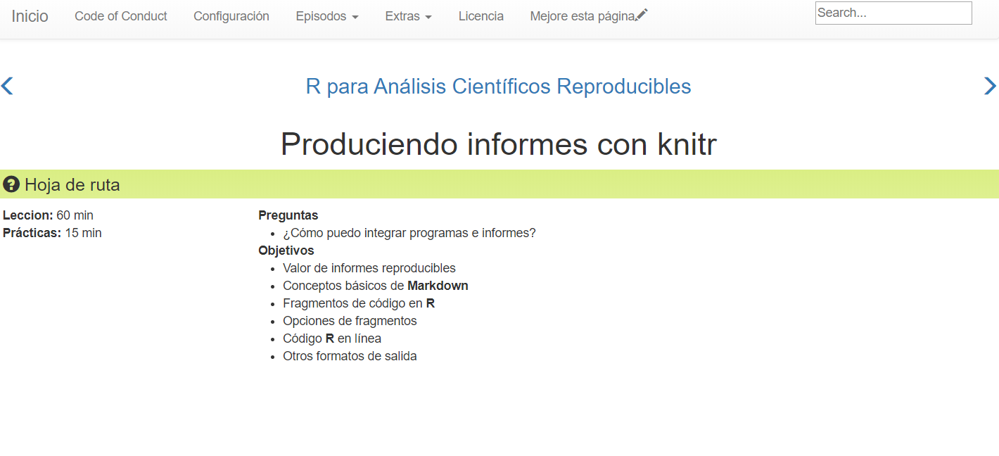

```{r setup, include=FALSE}
knitr::opts_chunk$set(echo = TRUE)
```

# **Tutoriales para aprender Rmarkdown**

## **1. Comparativa de expresiones regulares**  

<div style="text-align: justify">
Las expresiones regulares permiten filtrar textos para encontrar coincidencias, comprobar la validez de fechas, documentos de identidad o contraseñas, se pueden utilizar para reemplazar texto con unas características concretas por otro, y muchos más usos.  
A continuación, compararemos dos páginas de recursos para su aprendizaje que se pueden encontrar en Internet, destacando los pros y los contras de ambas.  

### 1.1. Descripción página 1  

[SISTRIX](https://www.sistrix.es/tutoriales/como-usar-expresiones-regulares/#Que_es_una_expresion_regular) es el primer recurso que vamos a estudiar:

<center>{width=70%}</center>

<div style="text-align: justify">
- _Contenido:_ Teórico y ejemplificativo. Contiene una estructura lógica, empezando por la teoría básica, para luego adentrarse en la implementación en R con sus debidos ejemplos.

- _Código:_ Correctamente ejecutado. Se muestra el código cuando es justificado y relevante, es decir, cuando quiere mostrar como se ha llegado a aquello que trata de enseñar.

- _Estética:_ Armoniosa y clara. Con un patrón coherente sin excesivos formatos de texto especiales.

### 1.2. Descripción página 2  

[Adictos al trabajo](https://www.adictosaltrabajo.com/2015/01/29/regexsam/) es el segundo recurso que vamos a estudiar:

<center>{width=70%}</center>

- _Contenido:_ Escaso y poco claro. Destaca las cuestiones teóricas básicas, sin poner ejemplos de ello. Para un usuario que se está iniciando con este lenguaje resulta complicado su comprendimiento y aplicación práctica.

- _Código:_ Limitado. Más allá de enlace a otras páginas web y cambio de color sin un patrón o lógica claros, no existe un código formulado de cierta complejidad.

- _Estética:_ Estresante. No cumple la normativa ortotipográfica ya que, tiene un color destacado y un tamaño de fuente mayor los subtítulos dentro de las secciones.

### 1.3. Conclusión   

<div style="text-align: justify">
El recurso más útil me fue el primero porque:  

Ventajas | Desventajas
-- | --
Diferenciado | Información reducida
Simple | No contiene ejemplos
Ordenado | No tiene paginas de referencia  

**Conclusión:** Se elegió el primer recurso porque este tiene todas las expresiones regulares diferenciadas.


## **2. Comparativa de RMarkdown**

<div style="text-align: justify">
R Markdown es un formato que permite una fácil creación de documentos, presentaciones dinámicas y informes de R. Markdown es un formato de sintaxis simple para crear documentos en HTML, PDF, y Word.  

A continuación, siguiendo con el mismo patrón que en el punto anterior, compararemos dos páginas de recursos para su aprendizaje que se pueden encontrar en Internet por su contenido, código y estética.  

En base a dichos puntos, concluiremos cuál es mejor y cuál peor para formarse y crear buenos documentos en formato R Markdown.

### 2.1. Descripción página 1  
[RStudio](https://rstudio.com/wp-content/uploads/2015/03/rmarkdown-spanish.pdf) es el primer recurso que vamos a estudiar:

<center>{width=70%}</center>
<div style="text-align: justify">

Es funcional pero se queda corta en contenido. En mi opinión esta página es peor ya que no es completa, únicamente explica sin ilustración lo más basico como son los titulos, listas y tablas.

### 2.2. Descripción página 2
[Github](https://swcarpentry.github.io/r-novice-gapminder-es/15-knitr-markdown/) es el segundo recurso que vamos a estudiar:

<center>{width=70%}</center>
<div style="text-align: justify">

En Software Carpentry Foundation muestra como crear informes en Markdown mostrando conceptos básicos y fragmentos de código en R. Por estas dos razones pienso que esta página es mejor ya que explica e ilustra cada uno de los conceptos de una manera en que cualquier persona pueda entender para que funciona cada línea que se escribe en el Markdown.<div/>

### 2.3. Conclusión  
<div style="text-align: justify">

**Conclusión:** RStudio es muy buen recurso para, de un vistazo, poder saber lo básico que alcanza un documento RMarkdown.


## **3. Carga y muestreo de datos**

<div style="text-align: justify">
A continuación, trabajaremos el conjunto de datos `Cars` y `mtCars` que muestra las distancias y frenado de los vehiculos.

Las diferentes variables recogidas en dichos _datasets_ son las siguientes:

`Cars`
```{r echo=FALSE}

colnames(cars) 

```

`mtCars`
```{r echo=FALSE}

colnames(mtcars) 

```
Donde:

1. _Speed:_ Velocidad en millas/hora
2. _Dist:_ Distancia de frenado en pies
3. _mpg:_ Millas por galon
4. _cyl:_ Cilindros del coche
5. _hp:_ Caballos de fuerza
6. _am:_ Tipo de transmisión
7. _gear:_ Número de marchas

### 3.1 Dataframe `Cars`
Primero, veremos la gráfica de velocidad y distancia de frenado en `Cars` 

```{r echo=FALSE}

names(cars) <- tolower(names(cars))

plot(cars, xlab = "Velocidad (mph)", ylab = "Distancia de frenado (ft)",
     las = 1)
title(main = "Data coches")
```

Después, veremos los datos estadisticos. Posteriormente las escalas logaritmicas de estas variables:

```{r echo=FALSE}

summary(fm1 <- lm(log(dist) ~ log(speed), data = cars))
opar <- par(mfrow = c(2, 2), oma = c(0, 0, 1.1, 0),
            mar = c(4.1, 4.1, 2.1, 1.1))
plot(fm1)
par(opar)
  
```

### 3.2 Dataframe `mtCars`

Luego para mostrar la densidad de acuerdo al consumo por galon por tipo de carro del dataframe `mtCars`

```{r echo=FALSE}

library(ggplot2)
#use color brewer as default discrete colors
scale_colour_discrete <- function(...) scale_color_brewer(palette="Set1", ...)
scale_fill_discrete <- function(...) scale_fill_brewer(palette="Set1", ...)

data('mtcars')
# create factors with value labels
mtcars$gear <- factor(mtcars$gear,levels=c(3,4,5),
                      labels=c("3 marchas","4 marchas","5 marchas"))
mtcars$am <- factor(mtcars$am,levels=c(0,1),
                    labels=c("Automatico","Manual"))
mtcars$cyl <- factor(mtcars$cyl,levels=c(4,6,8),
                     labels=c("4 cilindros","6 cilindros","8 cilindros"))
qplot(mpg, data=mtcars, geom="density", fill=gear, alpha=I(.5),
      main="Distribución de gasolina por milla", xlab="Millas por galón",
      ylab="Densidad")
```

### 3.3 Conclusiones Rmarkdown ggplot
Los documentos de solución de problemas en R Markdown pueden ser un desafío porque no te encuentras en un ambiente de R interactivo, y necesitarás aprender algunos trucos nuevos. La primer cosa que debes intentar es recrear el problema en una sesión interactiva. Reinicia R, después “Ejecuta todos los bloques” (ya sea en el menú de código , bajo la zona de Ejecutar ), o con el atajo del teclado Ctrl + Alt + R. Si tienes suerte, eso recreará el problema, y podrás descubrir lo que esta ocurriendo interactivamente.

Si eso no ayuda, debe haber algo diferente entre tu ambiente interactivo y el ambiente de R Markdown. Tendrás que explorar sistemáticamente las opciones. La diferencia más común es el directorio de trabajo: el directorio de trabajo de R Markdown es el directorio en el que se encuentra. Revisa que el directorio de trabajo es el que esperas incluyendo getwd() en un bloque.

A continuación, piensa en todas las cosas que pueden causar el error. Necesitarás revisar sistemáticamente que tu sesión de R y tu sesión de R Markdown sean la misma. La manera mas fácil de hacer esto es fijar error = TRUE en el bloque que causa problemas, usa entonces print() y str() para revisar que la configuración es la esperada.